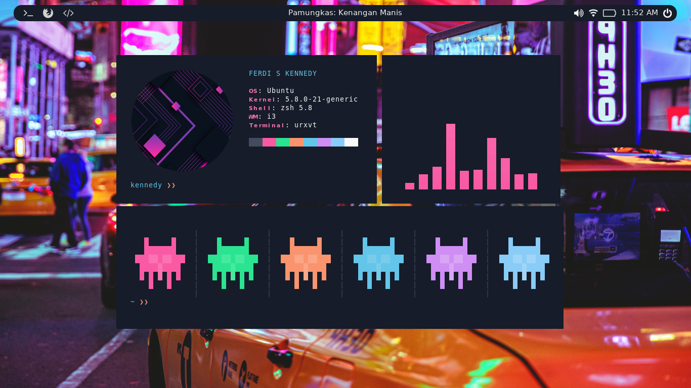
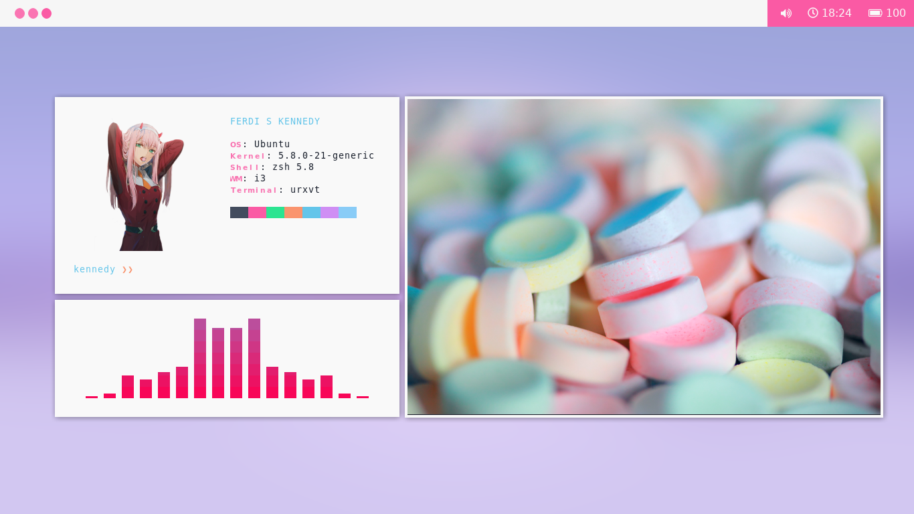

# My personal dotfile configuration

## Dark Theme

## Light Theme

# If u want change dark/light theme
## Change theme light 
super+b exec tint2 -c ~/.config/tint2/black.tint2rc
super+p exec feh --bg-scale ~/.wallpaper.png

## Change theme dark
super+y exec tint2 -c ~/.config/tint2/white.tint2rc
super+u exec feh --bg-scale ~/.wallpaper.jpg

## Details

- **Distro** Ubuntu
- **Display Server** X11
- **Display Manager** i3
- **Desktop Environment** N/A
- **Launcher** Rofi
- **Terminal** URxvt
- **Compositor** Compton
- **Shell** zsh
- **Cursor** Breeze
- **Bar** Tint2
- **wallpaper Gen** Feh
- **Icon at bar/panel** fontawesome 5 pro
- **Screenshot** scrot

- **NOTE! $super key is windows button**

## Launching i3
Logout your current session. Then login again with i3 session.  

## Some Cheatsheet
- **Super + Shift + D** Launch dmenu
- **Super + D** Launch dmenu alternative called Rofi
- **Super + Enter** Launch i3-sensible-terminal, URxvt in this case
- **Super + Arrow** Change focused window, if You have two or more windows in the workspace
- **Super + Shift + Arrow** Send focused window to another edge of the screen, if You have two or more windows in the workspace
- **Super + H** and **Super + V** Change split direction to horizontal or vertical
- **Super + S** Change split direction, if You already have splitted windows
- **Super + Space** Float the window, hit it again to back to tiling mode
- **Super + 1-6** Switch to workspace 1-6
- **Super + Shift + 1-6** Send the focused window to workspace 1-6 
- **Control + Alt + Left/Right** Switch to previous or next workspace. Only works if You have 2 workspace opened
- **Super + R** Resize mode. In resize mode, hit Arrow keys to do resizing. Hit Enter to back to normal mode
- **Super + C** or **Alt + F4** Close window
- **Super + Q** Quit i3wm
- **Super + L** Lockscreen. To unlock, type your user password then hit Enter
- **Super + Shift + R** Fully reload the configuration file. Hit this after do some modifications in the config file
- More keybind look on the configuration file.
